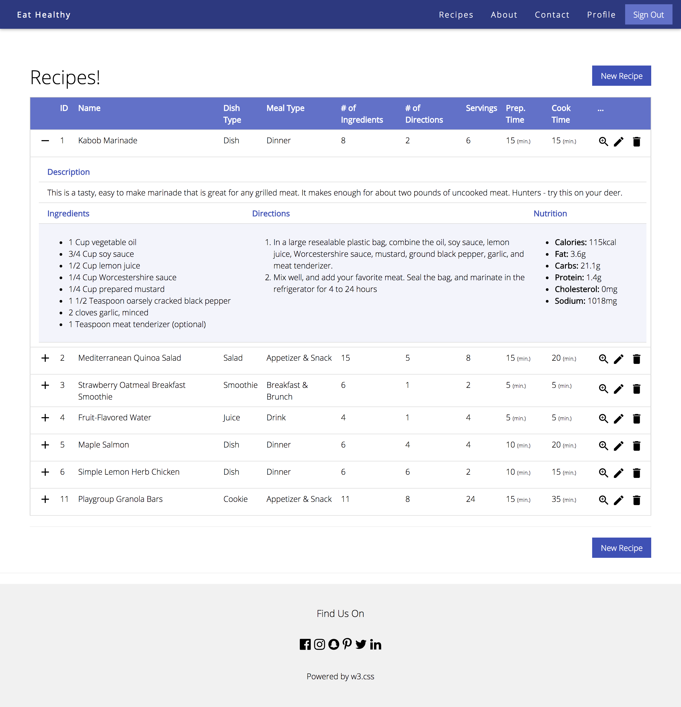

# Eat Healthy

1. What is the proposed name for your Web application?
    - Eat Healthy

2. Who is the target audience for your Web application?
    - Users who change their diet and eating behavior, and looking for healthy recipes.

3. What problem is it intended to solve for the target audience?
    - People might not have enough knowledge to identify the healthy recipe. Eating healthfully, doesn’t necessarily mean you have to chow down on salads all day long. There are plenty of healthy, hearty and tasty dishes that have positive effects on overall health. I am going to provide healthy recipes with their nutrition for free, and let users to review these recipes and bookmark their favorite dishes.

4. How will it meet the minimum project requirements?
    - The content, features, and services of my site will be available free of charge. Therefore, users do not require a sign-up/login to access the content. However, it is recommended in order to take advantage of all offered features. In order to finding an easy access to the site, I will support OAuth 2.0 for authentication. There are two user roles available with my site: administrator and member. Administrator role would be typically giving only one user who has access to all administrative options and features, including managing (CRUD processes on) all users’ profiles, recipes, etc. Member role is defined when a normal user signs up. Member is able to share recipes with others, give a feedback about recipes, and keep record of favorite dishes. All content will be stored into my database, including users’ credentials. All public data will be accessible through RESTful services that use data in both JSON and XML formats.

5. Why is your proposed Web application unique or creative beyond simply meeting the minimum requirements?
    - Beside the fact that my site will let their members to keep their preferred dishes in one place, easy to access from everywhere, at any time, there are some other remarkable features. To begin with, I will allow the users to rate recipes and provide feedback for those recipes giving a try. Therefore, members can benefit from reading those feedbacks in order to decide which recipe should they try.  In addition, adaptive recommender systems are becoming more common-place across various domains, and thus exhibiting recipes suggestions to users based on their preferences and feedback can make their visiting extraordinary.

## Build status

[](https://travis-ci.org/infsci2560sp17/full-stack-web-MHarbi)

## Changelog

[Changelog](CHANGELOG.md)

## Web Site 

[Eat Healthy](https://immense-garden-72100.herokuapp.com)


## Key Features

* User can add and display your recipes.
* All recipes can be retrieved through the api as a JSON format.
* A particular recipe could be retrieved by its ID through the api as a JSON format.
* Administrator has full control over all users/recipes data.
* Users can add comments.
* Users can upload multiple images to recipes
* Each user has full control over its own recipes (add/update/delete).
* Validation of forms using Javascript
* Anonymous user can explore the recipes.

## Project Details

### Landing Page

<<<<<<< HEAD


### User Input Form


=======
TODO : please provide a description of your landing page inluding a screen shot 

### User Input Form

TODO : please provide a description of at least 1 user input form including a screen shot 
>>>>>>> 7316845102dcbfa992d0fc6aee25d7cc34d3488a

## API

### API Method 1

    POST /public/api/recipes/:id

#### Parameters

- **id** _(required)_ — The Recipe ID to get its data.

#### Response

A JSON containing the Recipe data.

#### Errors

All known errors cause the resource to return HTTP error code header together with a JSON array containing at least 'status' and 'error' keys describing the source of error.

- **404 Not Found** — The recipe was not found.

#### Example

##### Request

    POST /public/api/recipes/1


##### JSON Response

```json
{
    "id":1,
    "title":"Kabob Marinade",
    "description":"This is a tasty, easy to make marinade that is great for any grilled meat. It makes enough for about two pounds of uncooked meat. Hunters - try this on your deer.",
    "dishType":"Dish",
    "mealType":"Dinner",
    "servings":6,
    "nutrition":
    {
        "id":1,
        "calories":115.0,
        "fat":3.6,
        "carbs":21.1,
        "protein":1.4,
        "cholesterol":0.0,
        "sodium":1018.0
    },
    "prepTime":15,
    "cookTime":15,
    "directions":
    [
        "In a large resealable plastic bag, combine the oil, soy sauce, lemon juice, Worcestershire sauce, mustard, ground black pepper, garlic, and meat tenderizer.",
        "Mix well, and add your favorite meat. Seal the bag, and marinate in the refrigerator for 4 to 24 hours"
    ],
    "ingredients":
    [
        {
            "id":1,
            "value":"1",
            "unit":"Cup",
            "text":"vegetable oil"
        },
        {
            "id":2,
            "value":"3/4",
            "unit":"Cup",
            "text":"soy sauce"
        },
        {
            "id":3,
            "value":"1/2",
            "unit":"Cup",
            "text":"lemon juice"
        },
        {
            "id":4,
            "value":"1/4",
            "unit":"Cup",
            "text":"Worcestershire sauce"
        },
        {
            "id":5,
            "value":"1/4",
            "unit":"Cup",
            "text":"prepared mustard"
        },
        {
            "id":6,
            "value":"1 1/2",
            "unit":"Teaspoon",
            "text":"oarsely cracked black pepper"
        },
        {
            "id":7,
            "value":"2",
            "unit":"None",
            "text":"cloves garlic, minced"
        },
        {
            "id":8,
            "value":"1",
            "unit":"Teaspoon",
            "text":"meat tenderizer (optional)"
        }
    ],
    "comments":[],
    "user":
    {
        "id":1,
        "firstName":"Mohammed",
        "lastName":"Alharbi",
        "gender":"Male",
        "email":"user@me.com",
        "active":1,
        "roles":["MEMBER"]
    }
}
```

## Technologies Used

- [Spring Boot](https://projects.spring.io/spring-boot/) - Takes an opinionated view of building production-ready Spring applications.
- [Thymleaf](http://www.thymeleaf.org/) - Thymeleaf is a modern server-side Java template engine for both web and standalone environments.
- [Maven](https://maven.apache.org/) - Apache Maven is a software project management and comprehension tool.
<<<<<<< HEAD
- [JQuery](https://jquery.com/) - jQuery is a cross-platform JavaScript library designed to simplify the client-side scripting of HTML.
- [jQuery Validation Plugin](https://jqueryvalidation.org/) - jQuery Validation Plugin is a feature rich jQuery plugin that makes it easy to validate user input while keeping your HTML markup clean from javascript code.
- [W3.CSS](https://www.w3schools.com/w3css/) - W3.CSS is a modern CSS framework with built-in responsiveness.
=======
>>>>>>> 7316845102dcbfa992d0fc6aee25d7cc34d3488a
